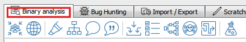
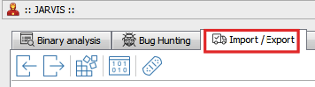
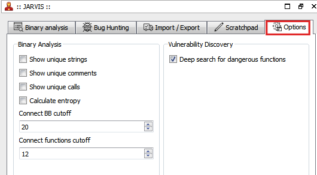
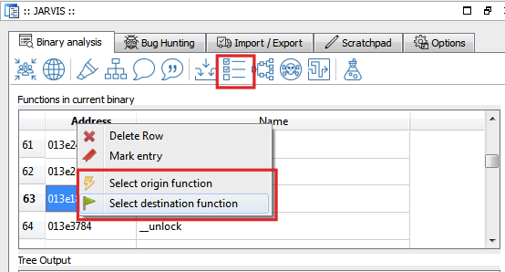
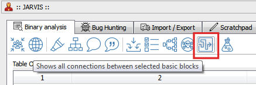
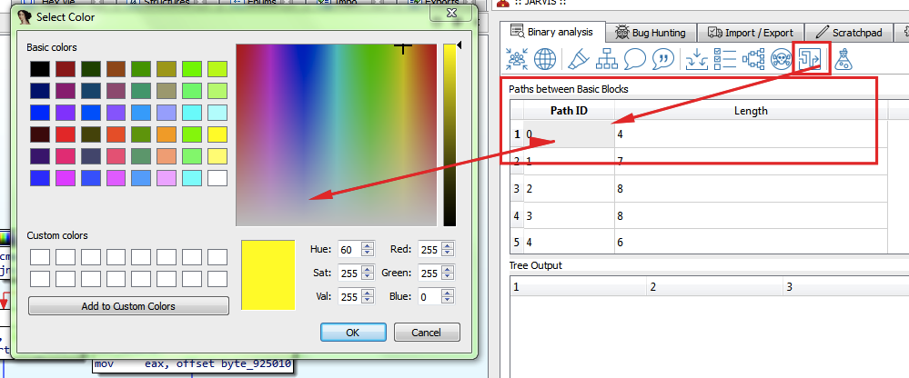
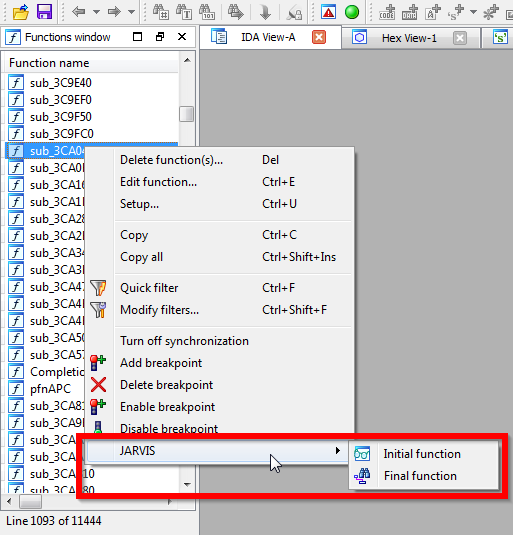
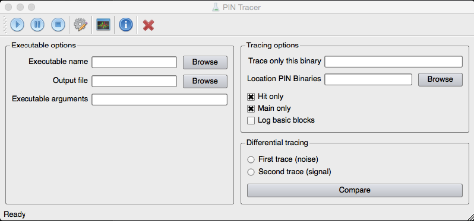

J.A.R.V.I.S.
============

FAQ
---

- Why _JARVIS_?
    - _JARVIS_ means "Just Another ReVersIng Suite" or whatever other bullshit you can think of :)

- What is it?
    - It is a small _bughunting_ suite comprising three elements, namely:
    - A fuzzer (to be released)
    - A tracer based on INTEL PIN
    - A plugin for IDA Pro thought to assist you with the most common reversing tasks. It integrates with the tracer.
    
- Isn't there already something similar?
    - Yes, "curious minds often converge on the same idea" :) and by the way, there is nothing new under the sun. 
    Now seriously, Alex and Daniel got it right with the code organization of their [IDAScope plugin](https://bitbucket.org/daniel_plohmann/simplifire.idascope), so I used it as a skeleton for mine. Kudos to them!
    
- Why does the code suck so much?
    - Don't let physicists do computer science.
    

## Installation ##

_JARVIS_ is written entirely in Python and it is thought to be completely standalone. That means, although it runs within IDA, you can just copy its whole directory to anywhere you want.
However, it is recommended (as a matter of convenience) to copy the __jarvis__ directory and the plugin __jarvis_launcher.py__ to __plugins/__

The auxiliary plugin _jarvis_launcher.py_ registers a shortcut (Alt-J) which launches the actual plugin.

### Dependencies ###

- Python 2.7.x (grab it [here](https://www.python.org/downloads))
    - Recommended Python 2.7.9+ (includes pip)
- NetworkX (pip install networkx)
- IDA Pro :)

## Graphical User Interface ##

_JARVIS_ is written in PySide (Qt). It consists of a dockable Widget with several __tabs__, one for each different _category_.

There are three different kinds of widgets, namely:

- Table view (for example _calls within current function_)
- Tree view (for example _dword compares_)
- Text view (the _logging_ at the bottom)

### Binary Analysis ###

Functionality related to __binary analysis__ (dough!) without any special emphasis in vulnerability finding.

At least I tried, sometimes the line between both is too thin...

The options available in this tab are:

- Show most referenced functions
- Show dword compares
    - Checks whether global variables are being compared to immediate values (binary-wide). These usually hold things like error codes or alike. Identifying and renaming them allow a better understanding of new code when found again.
- Mark immediate compares within the current function
    - It is helpful when analyzing something like a parser, for example.
- Show calls within the current function
    - When reversing large functions it is nice to have all information at once. For example, if at once all calls are UI related, we can probably just rename this function and move on.
- Show comments within the current function
- Show referenced strings within the current function
- Show input (file and network) connecting to the current function
    - Functions accepting any kind of input, for which there is a path connecting them and the current function.
- Show a list of all functions in the binary
    - This is no longer necessary, will probably disappear in next versions.
- Display connection graph (functions)
- Get all connections between functions accepting input and functions calling dangerous APIs
    - This is very CPU intensive, use with caution.
- Paint path(s) connecting two basic blocks
- XOR selected bytes
    - useful with malware / simple encryption schemes

### Bug Hunting ###

Functionality specifically designed around bug hunting goes here.

There is not much at the moment...

- Detection of banned APIs (MS)
- Integer issues
    - Right now this is too x86 specific
    - Buggy and it gets confused sometimes by loops or alike. However, false positives are quickly detected and discarded by a human agent. 
    - There will be false positives and negatives but as a rule of thumb you will need 10 minutes (tops) to go through them. On the bright side you will have found a handful of _potentially_ exploitable code spots (stack, heap based buffer overflows). 
    - Now you need to determine whether you can influence the parameters with your input.

### Import & Export ###

This is for interacting with external tools.

- Import a call trace from a _PinTool_
- Export the trace to file in _GraphML_ format
    - Import it to an external graph editor / viewer like Yed
- Import dynamic call resolution from a _PinTool_
- Export current function as hex
    - This is needed by some tools
- Export patched bytes to file
    - Creates a copy of the original file replacing the bytes patched in the IDA database.
    - Requested by m1k3 :)

### Scratchpad ###

This is the __killer feature__ :)
You can even save your notes to a file!

Yes, I know IDA Pro already has this feature and saves the data to the IDB file but it looked convenient to have everything in one place.

### Options ###

Runtime options controlling things like the amount of information being displayed, etc.

- Show unique strings
- Show unique comments
- Show unique calls
- Calculate entropy (for strings)
- Connect BB cutoff
    - The cutoff parameter for the algorithm calculating paths between basic blocks
- Connect functions cutoff
    - Analogous to the previous but for paths between functions

### Other GUI augmentation ###

__NOTE__: a large amount of people still using an older version of IDA, for unknown reasons (cough, chinese guy, cough, australian company). Since the GUI features described below are based on changes introduced in version 6.7 of IDA, JARVIS was unable to start.

A quick workaround has been introduced to allow JARVIS to run in older versions of IDA, with limited functionality. 
However, the "connect functions" graph can still be used by selecting the origin and destination functions clicking the "show all functions" button and using the context menu (see screenshot below)

__And now for the IDA 6.7+ users__

The main goal of _JARVIS_ is to get out of the way while adding some nice features which allow you to work faster. With this goal in mind, some _GUI augmentation_ has been added for your clicking pleasure.

__Calculating paths between basic blocks__

A new context menu has been added to the _disassembly view (the graph thingy)_. Of course it is labeled _JARVIS_.

Simply right click the basic block on the graph view and select the appropiate menu entry. You will see some logging on IDA's _output window_

Once you got both start and end basic blocks selected, click the _connect basic blocks_ button to get a list of all possible paths connecting them.

Double clicking the _Path ID_ you will be presented with a color chooser widget where you can select a custom color to paint the choosen path on the graph view. 

A penetrating yellow, for example, always does the trick :)

Voila! There you have your very visual path between basic blocks.

__Calculating paths between functions__

Similarly to the method explained above, _JARVIS_ adds a new menu item to the popup for the _functions window_

The graph is of course _clickable_ and will take you to the corresponding function in IDA's _disassembly view_ by double clicking on a node.

## PinTracer ##

The complementary tracing tool is __Intel PIN based__ with a _PySide_ GUI.

Since IDA Pro has a version of PySide itself, it is advised to install PySide in a _virtual environment_ ([read this](https://github.com/kennethreitz/python-guide/blob/master/docs/dev/virtualenvs.rst))

__To install it:__

- Move the PinTracer folder to some location of your choice.
- Run the _install.bat_ file. It will create a JARVISVE directory within PinTracer, create a virtual environment and install PySide
- That should be it :)

The batch script _run.bat_ takes care of transparently preparing the virtual environment and running the PinTracer program.

About the PinTool itself. A version compiled for Windows 32 bits against [Pin 71313 (vc12)](http://software.intel.com/sites/landingpage/pintool/downloads/pin-2.14-71313-msvc12-windows.zip) is included.
If you have another version of Pin, you will need to compile the PinTool against it. The source code is included (PinTracer/src_pintool/PinTracer.cpp) and the simplest way to compile it is to use the _MyPinTool_ trick, 
well described [here](http://scrammed.blogspot.de/2013/03/binary-instrumentation-for-exploit_10.html)
